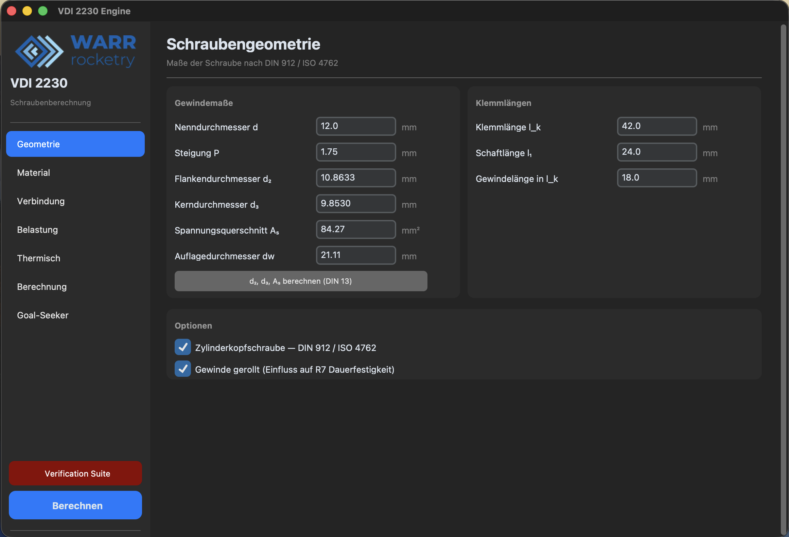
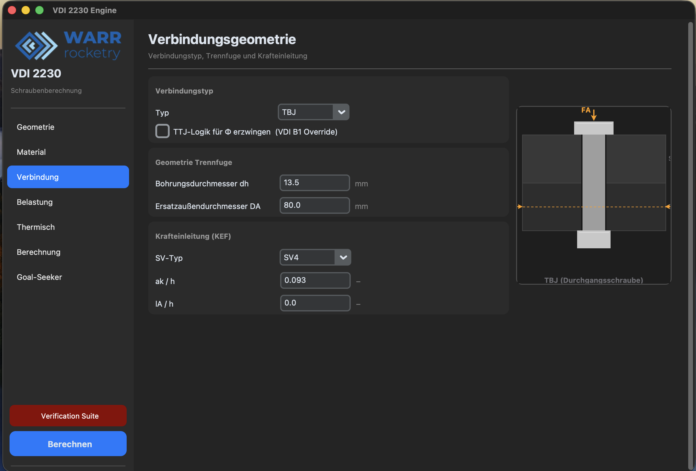
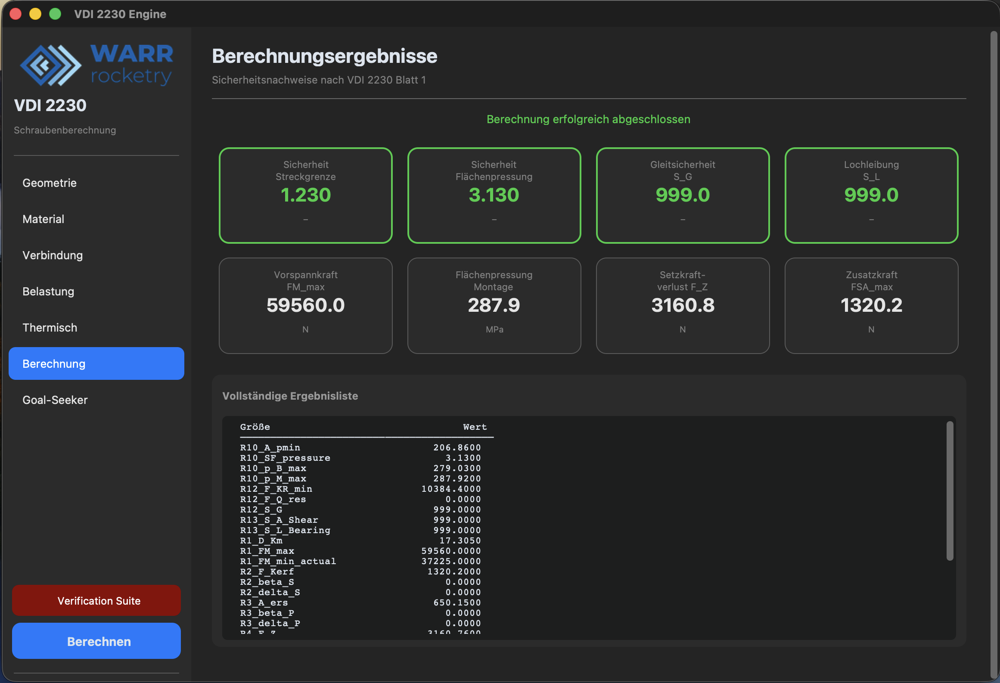
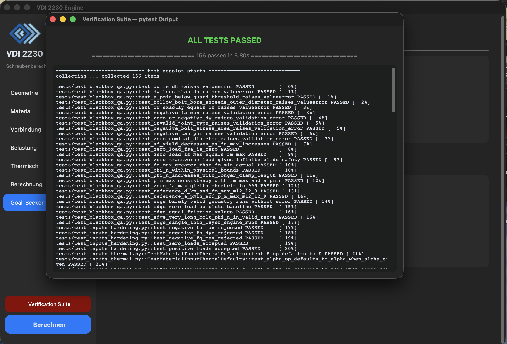

# VDI 2230 Bolt Joint Analysis Tool

A desktop calculation tool for high-duty bolted joints following **VDI 2230 Blatt 1:2015**.

The source code is not public as this is an internal team tool.

---

## Background

Standard bolt calculators assume steel-on-steel joints and off-the-shelf threads. Aerospace components frequently don't — Inconel fasteners in aluminium or copper housings, custom fine threads, thin titanium flanges. Getting the preload and safety factors wrong in those configurations has real consequences, so the tool calculates everything from first principles rather than relying on lookup tables or rule-of-thumb defaults.

VDI 2230 is the German engineering standard for systematic calculation of high-duty bolted joints. Its calculation sequence (R1–R13) covers preload, bolt and plate compliance, load distribution, stress verification, and joint opening — about as thorough as hand calculation gets before FEM.

---

## What it does

Implements the full VDI 2230 Blatt 1 calculation sequence for a single bolted joint:

- **R1** — Required assembly preload and tightening torque
- **R2/R3** — Bolt and clamped-plate compliance (elastic resilience), including multi-material plate stacks with exact analytical slicing — no averaged modulus approximations
- **R4** — Load introduction factor (Φ), with configurable force application point
- **R5** — Additional bolt load under operating conditions
- **R6** — Bending moment from eccentric loading
- **R8** — Stress verification: von Mises equivalent stress and yield safety factor
- **R9/R10** — Surface pressure check at bolt head and thread engagement
- **R11** — Minimum thread engagement for custom threads, using shear cylinder method (Alexander approach) — not static tables
- **R12** — Clamp load check; joint opening detection
- **R13** — Alternating stress fatigue check

Every formula is implemented directly from the norm with equation citations in the source. No formula is assumed or approximated without a cited norm basis.

**Thermal analysis** — operating temperature shift in preload is tracked separately: bolt and plate thermal expansion coefficients are provided independently, and the resulting preload change is computed and displayed alongside the isothermal results.

---

## Input model

All parameters are passed through structured input classes validated on entry. The tool rejects impossible geometry immediately rather than producing wrong results silently — for example, negative clamp load, bearing area smaller than the hole, or thread engagement below the calculated minimum.

Supported joint configurations:

| Feature | Detail |
|---|---|
| Plate stacks | Arbitrary number of layers, each with its own material (E-modulus) |
| Thread types | Standard ISO metric; custom pitch and diameter |
| Force application | Concentric or eccentric, configurable load introduction factor |
| Thermal load | Independent bolt/plate expansion coefficients, operating temperature |
| Tightening | Torque-controlled or angle-controlled, configurable scatter |

---

## Status

Blatt 1 (single joint) is complete.

A **Blatt 2 extension** for arbitrary multi-bolt group patterns under full 3D external loads (Fz, Fx, Fy, Mx, My, Mz) is currently in development. It will distribute loads across the bolt group per VDI 2230 Blatt 2 and feed the critical bolt's loads into the existing single-joint engine automatically.

---

## Screenshots

**Bolt geometry input:**

**Joint geometry input:**

**Calculation results** — full R1–R13 output with safety factors:

**Multi-material plate stack** — each layer defined independently with its own material and E-modulus:

**Goal seeker** — reverse solver: find the geometry or load that meets a target surface pressure:

**Test suite** — 156 tests covering physical invariants, norm examples, and edge cases; run against every change:

---

## Tech

Python · Pydantic · Tkinter · pytest
